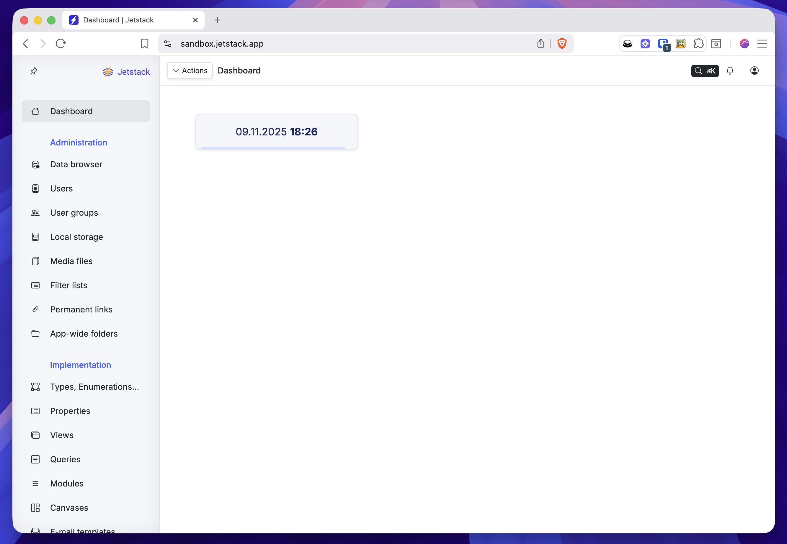
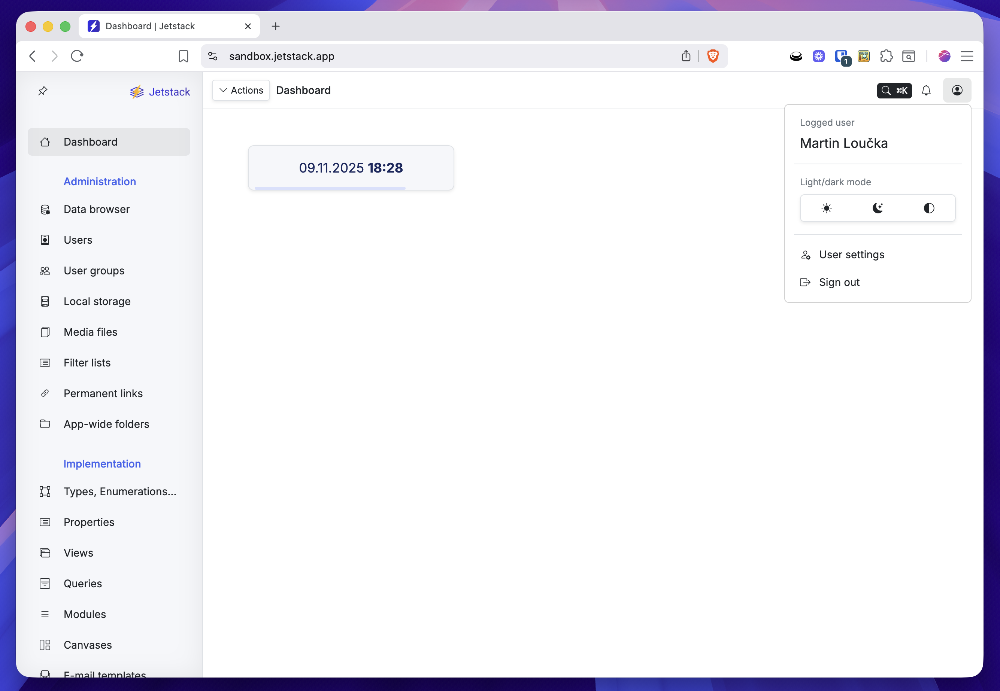
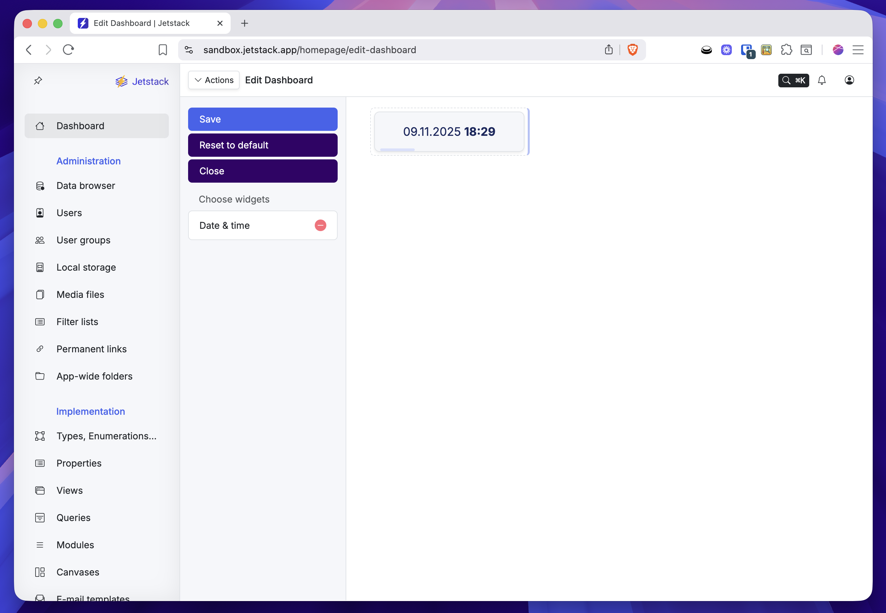

# Výchozí dashboard Jetstacku : Uživatelská dokumentace

Výchozí dashboard Jetstacku je místem, které se zobrazí ihned po přihlášení do platformy. Dashboard slouží jako domovská stránka a rozcestník do všech klíčových částí systému.

Po otevření dashboardu se zobrazí místo s widgety a tři hlavní části:

1. **Levé navigační menu** - primární menu pro pohyb v systému.  
2. **Uživatelské menu(vpravo nahoře)** - umožňuje spravovat účet a přepínat vzhled aplikace.
3. **Režim úprav dashboardu(nahoře)** - editační režim, ve kterém je možné dashboard přizpůsobit.

   

---

## 1. Levé navigační menu

Na levé straně je kompletní struktura Jetstacku. Každá sekce má svůj účel:

### **Dashboard**
- Vrací zpět na úvodní domovskou obrazovku.

### **Administration**
- Sekce zaměřená na správu dat a uživatelů:
  - **Data browser** – nástroj pro prohlížení a kontrolu uložených dat.
  - **Users** – správa uživatelských účtů.
  - **User groups** – definování a organizace uživatelských skupin.
  - **Local storage** – správa lokálních úložišť a uložených hodnot.
  - **Media files** – přehled a správa nahraných mediálních souborů.
  - **Filter lists** – nastavení a správa předdefinovaných filtrů.
  - **Permanent links** – tvorba trvalých odkazů na konkrétní zdroje nebo pohledy.
  - **App-wide folders** – správa složek sdílených napříč celou aplikací.

### **Implementation**
- Sekce pro stavbu aplikaci:
  - **Types, Enumerations…** – definice datových typů.
  - **Properties** – jednotlivé atributy typů.
  - **Views** – zobrazení dat pro koncové uživatele.
  - **Queries** – datové dotazy.
  - **Modules** – logické celky aplikace.
  - **Canvases** – uživatelská rozhraní aplikace.

Kliknutím na položku menu se otevře odpovídající nástroj na hlavní ploše.

---

## 2. Uživatelské menu (po kliknutí na ikonu)
  
Zobrazí se rozbalovací menu obsahující:

- **Jméno a informace o přihlášeném uživateli**.
- **Light/Dark mode** - přepínač světlého / tmavého / automatického režimu.
- **User settings** - odkaz na nastavení profilu.
- **Sign out** - Možnost odhlásit se ze systému.

---

## 3. Režim úprav dashboardu
  
Kliknutím na **Actions → Edit Dashboard** se otevře editační režim, ve kterém lze dashboard přizpůsobit.

### Co zde je možné dělat:

- **Přidávat widgety**  
  V panelu vlevo jsou dostupné widgety, např. *Date & time*. Kliknutím se přidávají na plochu.

- **Přesouvat widgety**  
  Přetažením myší je lze uspořádat dle potřeby.

- **Mazat widgety**  
  Každý widget má možnost odebrání (malá červená ikona).

- **Uložit / Resetovat / Zavřít**  
  - **Save** – uloží změny.  
  - **Reset to default** – vrátí dashboard do původního stavu.  
  - **Close** – zavře editační režim bez uložení.
